<!-- .slide: data-background="#000" data-transition="fade" -->
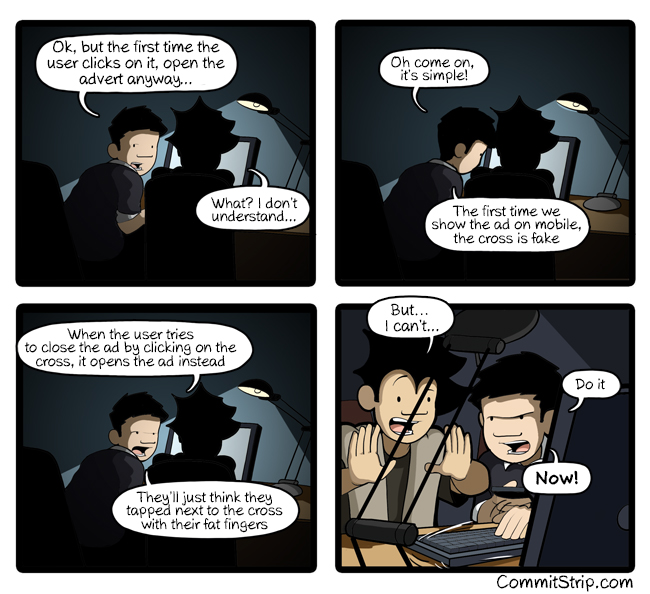 <!-- .element class="plain stretch" -->

---

<!-- .slide: data-background="#000" data-transition="fade" -->
<div class="spotlight"></div>

## Dark Patterns <!-- .element: style="color: #aaa" -->

### Into the light <!-- .element: style="color: #aaa" -->

---

<!-- .slide: data-background="#333" data-background-transition="fade" data-transition="fade" style="color: #aaa;" -->
## Me <!-- .element style="color: #aaa" -->

* David Beitey
* @davidjb / @davidjb_
* I wear many hats  🤠 🕵️ 🧙‍♂️
* UX designer, Developer, Sys Admin...

Notes:

* JCU eResearch Centre; Researchers --> technology
* Lots of different roles in the tech/research space
* Currently a User Experience designer, then I'll put my dev hat on
* Poke me if I get too technical; I'm a dev at heart

---

<!-- .slide: data-background="#666" data-background-transition="fade" data-transition="fade" -->

### tl;dr

* Dark Patterns control your behaviour
* Many sites/apps use them
* Defend yourself
* Think before implementing

---

<!-- .slide: data-background="#aaa" data-background-transition="fade" data-transition="fade" -->

### Thanks!

---

<!-- .slide: data-background="#ccc" data-background-transition="fade" data-transition="fade" -->

Share, ask questions, discuss
<br>
(tell me I'm wrong)

---

## ?

Notes:
* How many people design or implement digital UI, apps/web etc?
* ASK: Who's heard of Dark Patterns?
* What do you think of when you hear _Dark Patterns_? Eg:
  * Bad design?
  * Poor colour choices?
  * Evil coders and Matrix-code?
* Well, for avoidence of doubt, we're _NOT_ talking about


<!-- .slide: data-background-iframe="https://code.divshot.com/geo-bootstrap/" data-background-interactive -->

Notes:
* Poor design


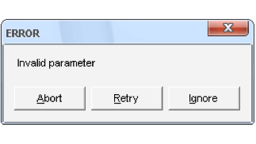 <!-- .element class="plain" style="height: 100%; max-height: 50vh"-->

Notes:
* Stuff that sucks
* Or is unintentionally confusing


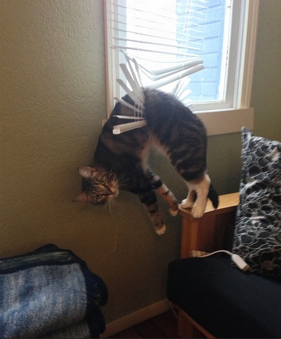 <!-- .element class="plain stretch" -->

Notes:
* Or just poor life choices
* Sorry to disappoint anyone here for the cat memes


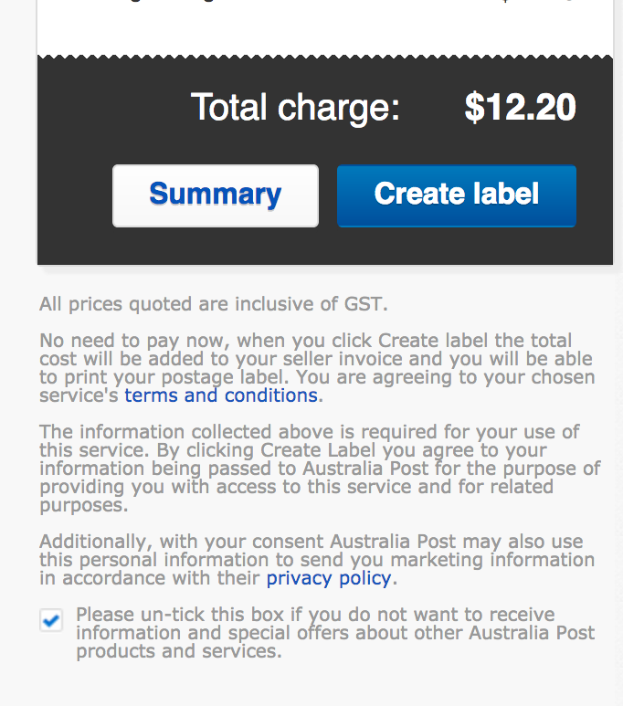 <!-- .element class="plain stretch" -->
## 🤔

Notes:
* What do you think / feel about this?
* What sticks out?
* Shouldn't have been ticked in the first place, no double-neg, etc
* This likely breaches the AU Spam Act 2003 because of lack of "express
  consent" (eg I have to click the box!)


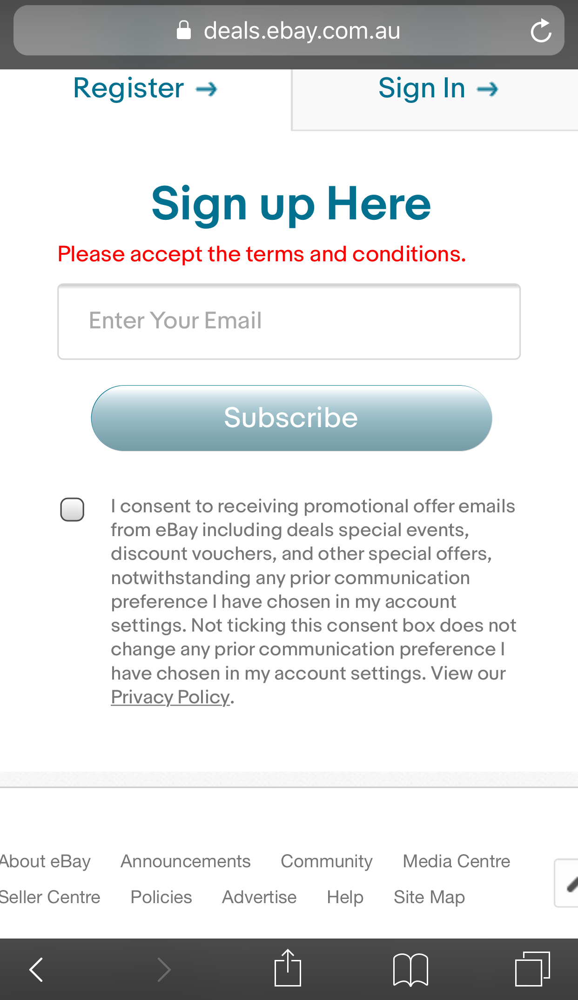 <!-- .element class="plain stretch"-->

This is actually a _required_ field!

Notes:
* My head exploded.
* I think I have to leave the box unchecked?
* But _actually_ it's mandatory field! (see the red text)
* These are called 'Trick Questions', as you might expect
* This _definitely_ breaches the Spam Act


# 🤯


> Dark Patterns are tricks used in websites and apps that make you buy or sign
> up for things that you didn't mean to. <!-- .element style="font-size: 3rem" -->

<br>
**Harry Brignull**, darkpatterns.org
<br>
@darkpatterns

Notes:
* Coined in 2010
* Aims to be a 'pattern library' for naming-and-shaming deceptive UI

---

## (Anti-)Pattern Library

Notes:
* Why/how do you think these concepts might work?
* The same things have existed for years
  * Record / CD clubs (dep on your age)
    * Started in 1927 book club auto-billing!
  * Tupperware parties
  * Paper Forms with opt-out boxes
  * Business practices in general (eg banks, airlines dodging calls or
    shifting blame/responsibility)
* You might call this 'Marketing', but if something's intentionally hard or
  deceptive, it's a dark pattern.


Intentionally

1. Confuse
1. Deceive
1. Exploit

Notes:
* Tonight, we're talking design and UI
* Looking at things that... [1/2/3]
* Usually via some form of psychology (eg default behaviour, laziness, skim
  reading etc)

---

### What have you seen?

Notes:
* This was *_really_* hard to prepare for; there's just so much out there.
* Think about what you've seen or experienced
  * Charges on a credit card bill?
  * Accidentally paying too much?
  * Stuff shared on social media w/out permission?
* Share your own experiences as we talk -- just yell out, put up your hand,
  etc -- it's a safe space, and we should all be able to talk about
  our experiences and what we've seen.
* Let's start by taking a look at what I've seen recently - I'm sure you can
  relate...
* Sometimes hard to distinguish between bad UX and a dark pattern, but these
  companies know better and have 100s of staff.

---

 <!-- .element class="plain logo" -->

Notes:
* Who trusts Jetstar?  Why/why not?  Experiences?
* Been forced to cleaned up their act, but noone stays good for long
  * Remember when Jetstar opted you into everything?
* Why? Human/govt intervention.
* That said, try these


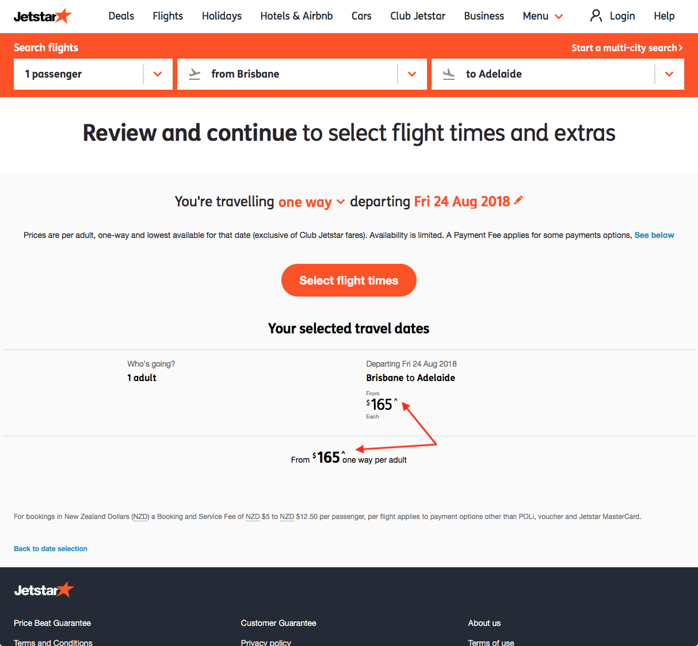 <!-- .element class="plain stretch" -->


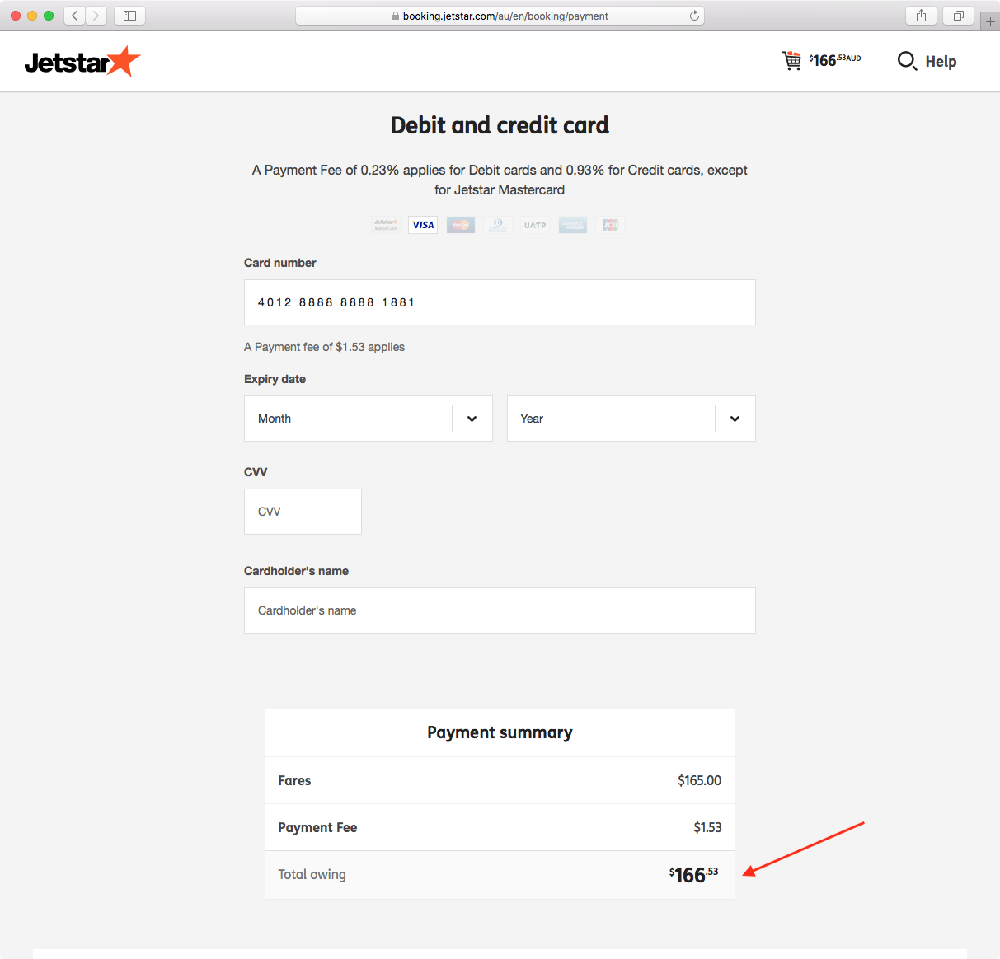 <!-- .element class="plain stretch" -->

Notes:
* Not my credit card number
* Who expected/was conditioned to see this?
* Sadly, I definitely am


### Hidden costs

Unexpected charges appear at the checkout (_drip pricing_)


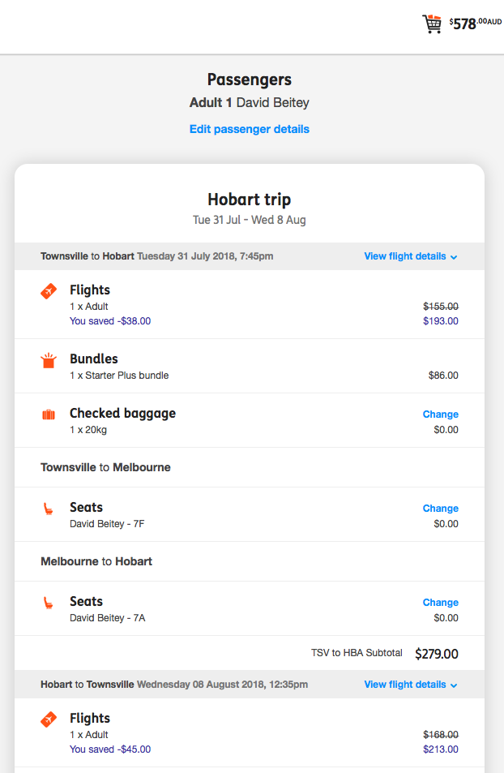 <!-- .element class="plain stretch" -->

Notes:
* What do you think when you see this?
* Many people are conditioned to click through
* I **almost** got done and got to the CC fields; I thought it was a "bonus"
  discount benefiting me
* They claimed a "system error" (A/B testing was happening)
* I _thought_ they're just bad coders


### Bait and Switch

Hey, where'd that rug go?


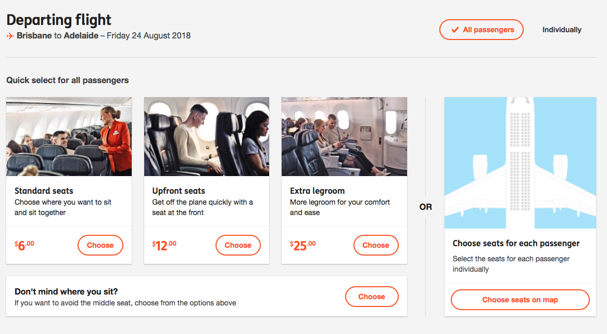 <!-- .element class="plain stretch" -->


### Misdirection

Look, a distraction!


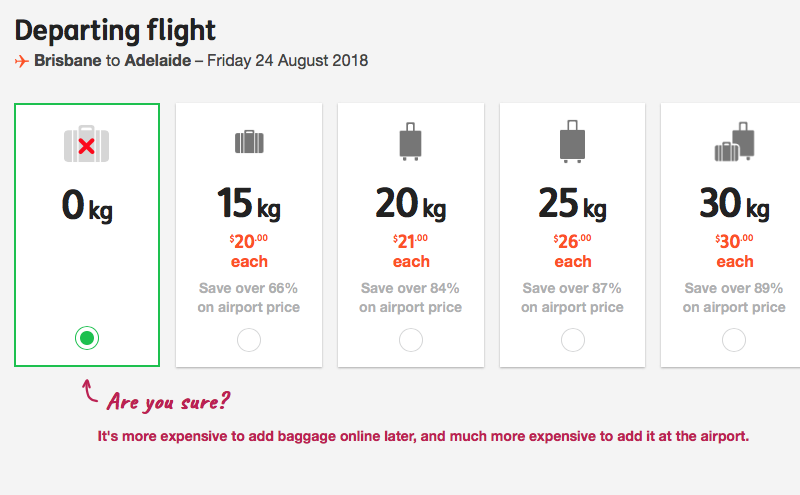 <!-- .element class="plain stretch" -->


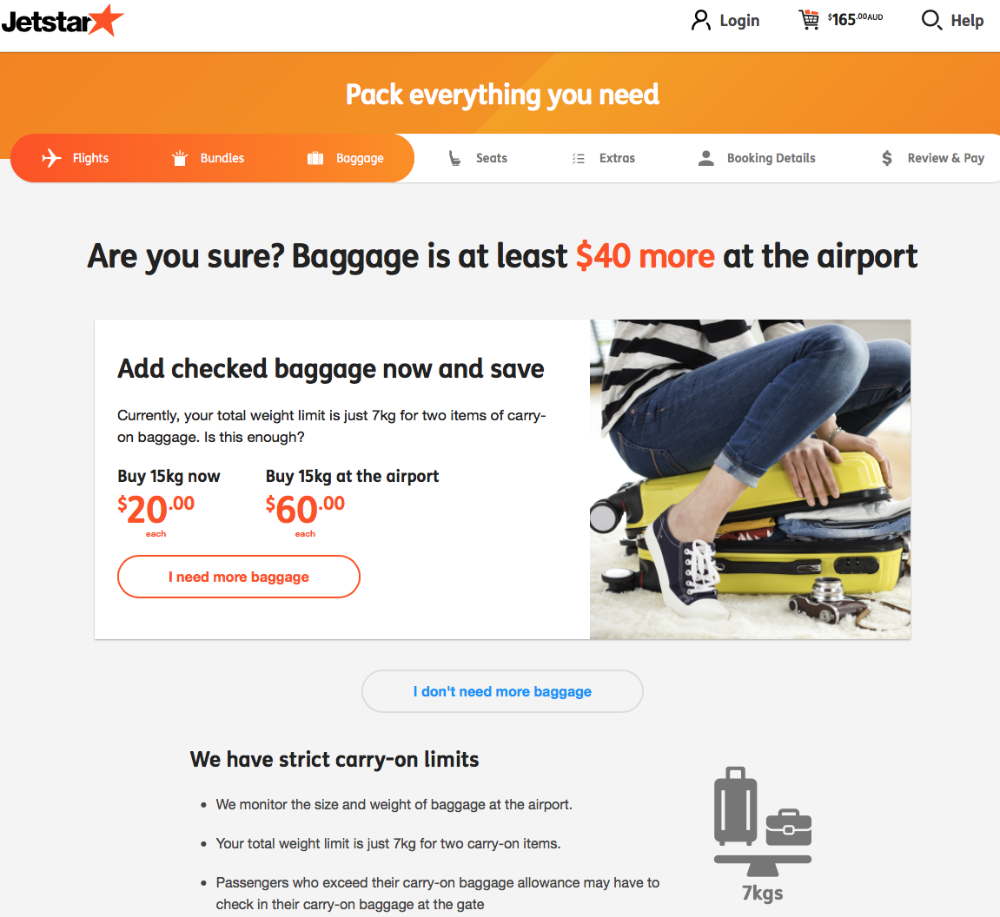 <!-- .element class="plain stretch" -->

Notes:
* How do you feel about this page?
* Note the careful wording, colour, photos, here to convince you
* They're doing you a _favour_ by discounting this now!
* Potential $2m in extra revenue from selling seats; this is why
* Jetstar is better, but this sort of thing is creeping back in again.


### Confirmshaming

Guilting & shaming you into compliance


### Impact

* Misled customers are angry & unhappy
* Regulatory action (ACCC)
* Fines / business impact

Notes:
* Eventually, dark patterns worked against them
* Australian Consumer Law prevents misleading conduct
* ACCC managed a $545k fine in 2016
* Aviation a priorty in 2017 for ACCC
* Legislation changes to handle CC fees, opt-out model etc

---

 <!-- .element class="plain logo" -->


<!-- .slide: data-background-iframe="https://open.spotify.com" data-background-interactive -->

Notes:
* Who trusts Spotify?  Why/why not?  Experiences?
* Spotify takes seconds to sign up
* But how about we _close_ our account??  Anyone ever tried this?
* User: dark.patterns at domain; Word: dp1


### Roach motel

Anything that's easy to get into, but hard to get out of.


### Forced Continuity

Automatic charges after a "free trial" and hard-to-cancel memberships.

---

 <!-- .element class="plain logo" -->
 <!-- .element class="plain logo" -->

Notes:
* Who trusts Facebook?  Why/why not?  Experiences?


<!-- .slide: data-transition="fade" -->
 <!-- .element class="plain stretch" style="border: 1px solid #ccc;" -->

Notes:
* Notice anything odd here?  What stands out?
* Fwiw, that arrow was actually animating; I just can't show that here...

* It's a _fake_ OS dialog box, which is tricking you here!
* Umm, so how do I say no??
* Let's tap "Manage Contacts"


<!-- .slide: data-transition="fade" -->
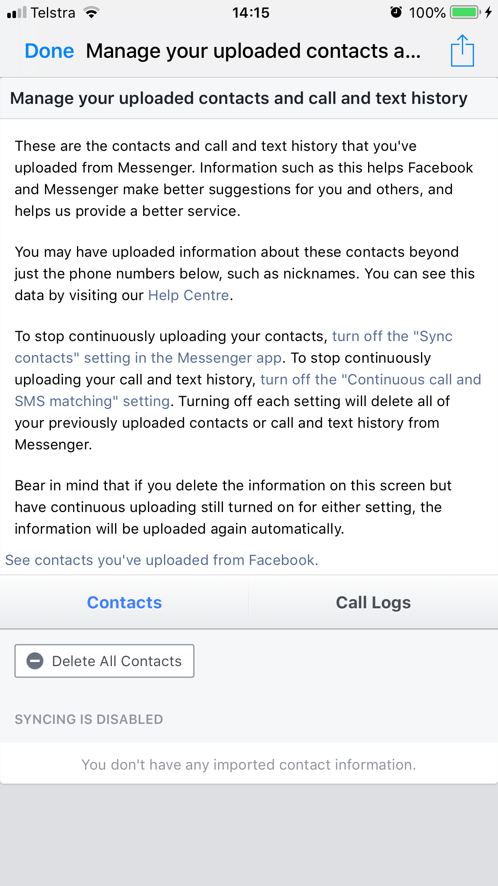 <!-- .element class="plain stretch" style="border: 1px solid #ccc" -->

Notes:
Hmm, that's not right; okay, let's go back.


<!-- .slide: data-transition="fade" -->
 <!-- .element class="plain stretch" style="border: 1px solid #ccc;" -->

Notes:
Okay, so there's no buttons left except for `Learn More`.  Let's do that.


<!-- .slide: data-transition="fade" -->
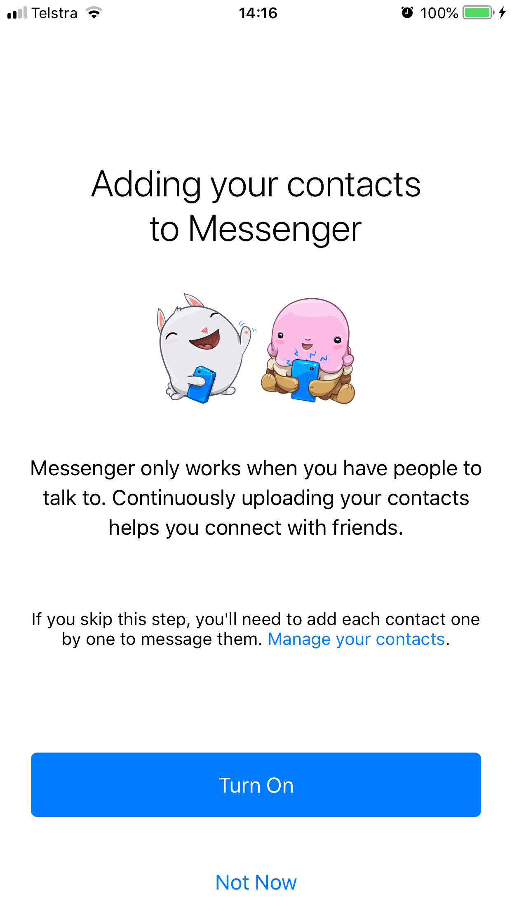 <!-- .element class="plain stretch" style="border: 1px solid #ccc" -->

Notes:
Oh, right yes, this is "learning more".
* Fat blobs on some drug-induced trip


<!-- .slide: data-transition="fade" -->
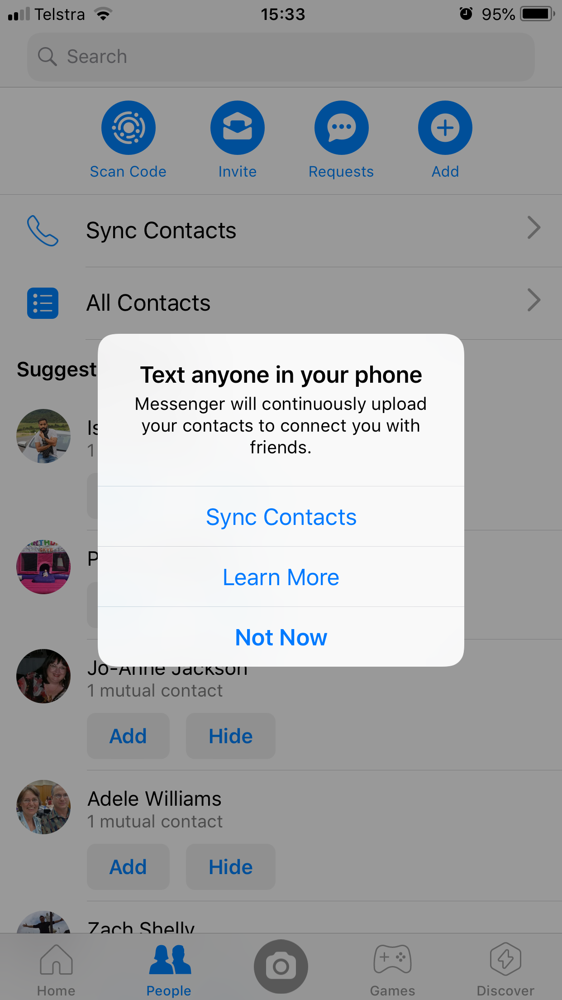 <!-- .element class="plain stretch" -->


<!-- .slide: data-transition="fade" -->
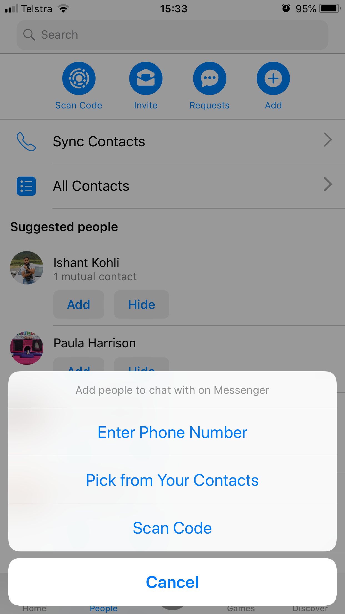 <!-- .element class="plain stretch" -->


<!-- .slide: data-transition="fade" -->
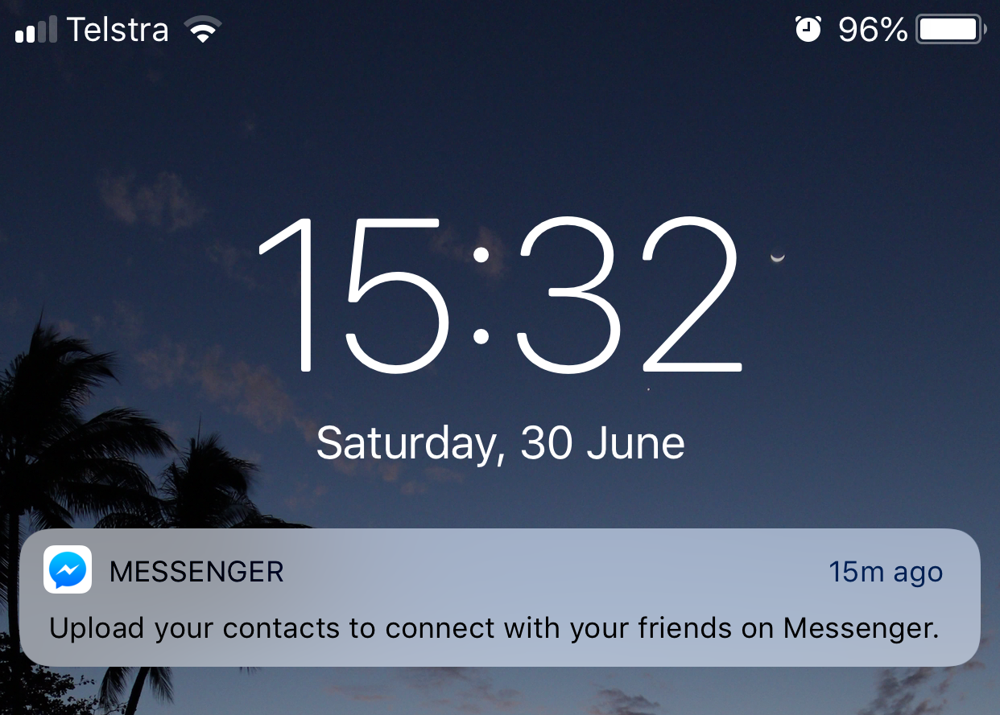 <!-- .element class="plain stretch" -->


### Privacy Zuckering

Being tricked into sharing more information than you want. Eponymously named.

Notes:
* **Now** who trusts Facebook?  Less/more?
* So what's the consequence of this type of thing?


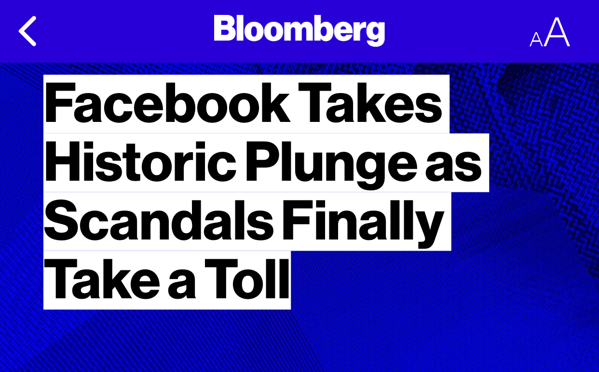 <!-- .element class="plain stretch" -->


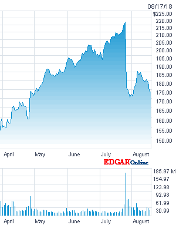 <!-- .element class="plain stretch" -->

$120B drop in one day

Notes:
* Largest over loss in one day for a US company
* Not specifically this Messenger concern (ha), but the decreased
  growth associated with all the on-going scandals.


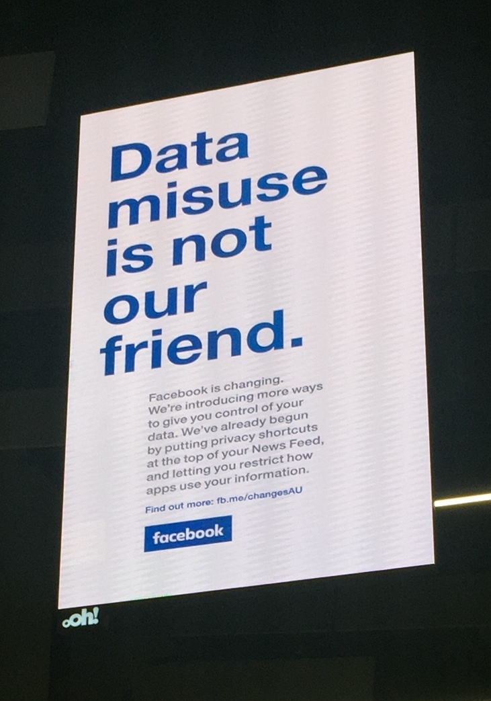 <!-- .element class="plain stretch" -->

Notes:
* Large, 10m billboards in Melbourne airport (2 weeks ago)
* Ads continuously on US TV earlier in the year

---

 <!-- .element class="plain logo" -->
<br>
 <!-- .element class="plain logo" -->


### Live examples

<https://booking.com.au>

<https://expedia.com.au>

Notes:
* FOMO
* Animations
* Pressure; virtual salesman
* Detail that just doesn't matter! ("Just added!")
* Just booked = ?? weeks ago?
* Number of rooms = hotel could be that small (eg 1 holiday rental)


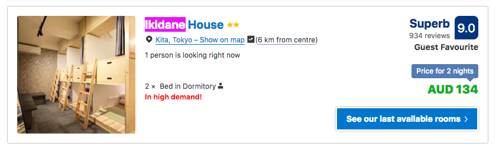 <!-- .element class="plain stretch" -->

```html
<div class="js_sr_persuation_msg">
  <span class="in-high-demand-not-scarce">
    In high demand!
  </span>
</div>
```

Notes:
* Booking.com
* They can't even spell persuasion right
* This line went away later
* The CTA button is a complete lie


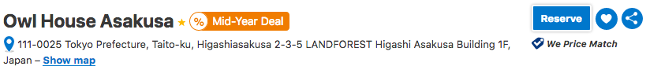 <!-- .element class="plain stretch" -->
<br>
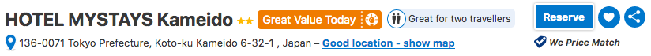 <!-- .element class="plain stretch" -->

```html
<div class="d-deal d-deal__lonely d-deal__preset-deal"
     aria-hidden="true">
  <div class="d-deal-b d-deal-preset">
    <p>
      Mid-Year Deal
    </p>
  </div>
</div>
```


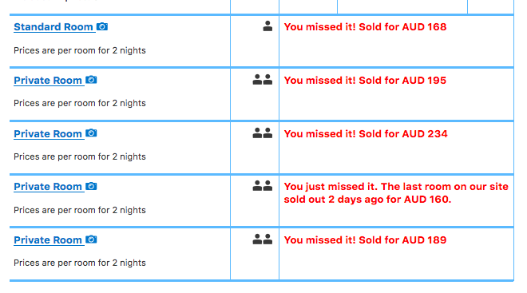 <!-- .element class="plain" -->

> To give you an idea of the price range, we looked at how much this was
> booked for when it sold out. The price we're showing is based on the average
> price per night.

Notes:
* Yeah, right; that's why it's there.
* Even if this was true, it could have been booked a year ago.


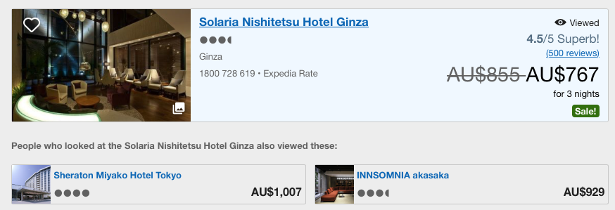 <!-- .element class="plain stretch" -->

```html
<article class="decoys">
  ...
</article>
```

Notes:
* Expedia
* Also, who the heck is going to stay at a hotel called INSOMNIA?


### Disguised Ads

Ads disguised as content or navigation so you'll click them


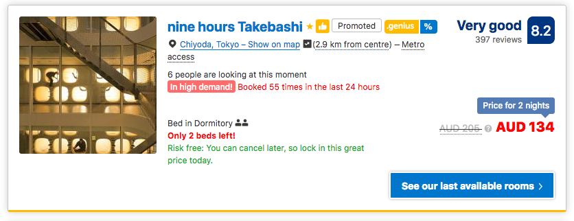 <!-- .element class="plain stretch" -->

> This is a Preferred property. They provide excellent service, a great value,
> and have awesome reviews from Booking.com guests. They might pay Booking.com
> a little more to be in this program.


 <!-- .element class="plain" style="height: 50%; width: 50%;" -->

> The discount is based on the third highest current price of the property for
> rooms with the same booking conditions in a 20-day window around your
> check-in date (10 days before and 10 days after check-in date; if less than
> 10 days are between today and the check-in date, we will use the
> corresponding number of days after the check-in date to result in a 20-day
> total). To ensure we are making a fair comparison, we always use the same
> reservation conditions (meal plan, cancellation policy and room type). This
> means that you get the same room for a lower price compared to other
> check-in dates at the same time of year. <!-- .element style="font-size: 70%;" -->

### 🤯


In short, they're **everywhere**.
<br>
It's their _entire business_.


 <!-- .element class="plain" style="height: 100%; max-height: 20vh"-->

https://github.com/davidjb/dont-panic
<br>
Browser filters for Dark Patterns
<br>
for uBlock Origin

Notes:
* Work in progress
* Playing around a bit with the idea after booking holidays


### Before and After

<https://booking.com.au>

<https://expedia.com.au>

Notes:
* Feelings before and after?

---

### David's cheat sheet

If you feel:

* pressure,
* panic,
* confusion, or
* see intrusive or "weird" behaviour...

<br>
_It's likely a Dark Pattern._

Notes:
* There's lots more Dark Patterns
  * Friend Spam: LinkedIn etc that demand your email password (!!)
  * Tabs that change their title and to catch your attention (!)
  * Popups that appear when you click _away_ from a tab
  * Pop-ups that make you think you have to subscribe
* If something looks to not work _right_ then your spider sense should be
  tingling.
* It could just be the system's borked...but big companies don't tend to screw
  up without it being on purpose.

---

### So...
what to do about it.

Notes:
* Quick show of hands: who likes these patterns and who doesn't?
* Thoughts? Who would/wouldn't use them?

---

## As a (UI) designer

Think before you design

Notes:
* If you do plan on implementing these ideas...


### Remember your users

Notes:
* Respect users --> they respect you
* We each have limits; breach those trust limits and I will stop
  using a service or buying a product.


### Avoid being (too) metric-diven

Notes:
* Being focused on a specific metric or KPI (key performance indicator),
  you'll use any hack or deception to get there
* Eg MyHealthRecord


Test your UX & design

Tricks frustrate users

Could affect your image & brand

Notes:
* Consider the 'default behaviour' for users
  * CTA/Call to Action on right; same spot
* Be clear - eg avoid text with double/triple negatives, etc
* Ask how users _feel_ (UXD); if your work makes sense
* Otherwise, you risk frustrating users
  * and affecting your brand (Jetstar, Facebook, etc)


# 🕴

Being clear makes business sense


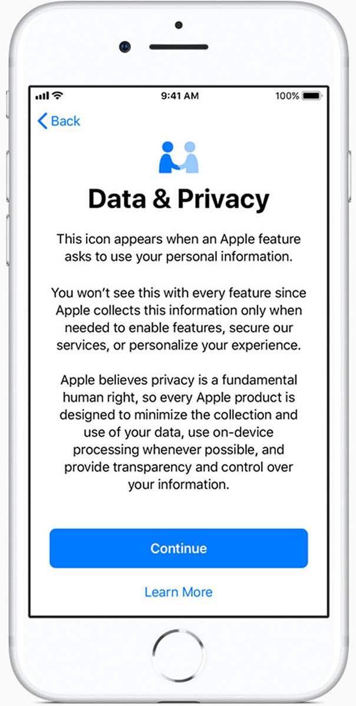 <!-- .element class="plain stretch" -->

Notes:
* Eg Apple is increasingly "open" about their data use.
* Not because they're a reputable company; they realised it's a USP and $$$
* They're still doing the same stuff; just more transparent


You might have to be honest
<br>
(legally)

<br>
ACCC, ACMA, Spam Act, GDPR, etc

Notes:
* From a legal point of view, you might have to be honest
  (eg ACCC with Jetstar / or GDPR fines of 2/4% gross revenue if you serve EU
  customers
  * That's me even though I work for JCU in Townsville)
* Work with your legal reps to check consent requirements, etc


### Work with your clients/stakeholders

Notes:
* They probably don't know!
* Help them understand implications (social/risks/legal)
* Don't feel pressured; be comfortable
  * Decide your morality on your own terms


### Do unto others

Notes:

* If you feel uncomfortable, listen to that gut feeling
* Do unto others; Would you feel okay with dark patterns being used against
  _you_?

---

## As a user

Be aware

Notes:
* Unfortunately, we can't clean up the entire web with a tool like my "Don't
  Panic" filter.
* Ad blockers like uBlock Origin can help, but don't typically
  affect "non-ad" page content
* So it's on us as individuals to be aware
* Not just in UI, but everyday life too


Carefully read _everything_ you agree to

&

Be prepared to back out

Notes:
* Just like if you're buying/renting a car or shopping at Harvey Norman
* These sales people are in it for **themselves** so once you remember that,
  you're at least on an even footing


### Apply pressure

Complain to company

Leverage social media

Notes:
* Companies don't like being identified publicly
* So mention them on Twitter/social media
* Much faster & responsive than phone/contact/etc


### Report if necessary

Contact ACCC/ACMA/authorities

Consider legal action

---

### tl;dr

* Dark Patterns = deceptive UI
* Expect them
* Work with your stakeholders
* Do unto others
* Raise your voice as a user

Notes:
* Seen some Dark Patterns
* and how to spot them
* What you should consider as a designer
* and as a user
* Goes beyond just UI & design
* Finally, know that Dark Patterns extends deeper than just a user interface.
* We won't *not* see businesses trying to deceive us, but you have knowledge
  of what they might try now.

---

### Questions/Thoughts?

<br>
# 👨‍💻

David Beitey
<br>
https://davidjb.com

Notes:
* Who thought these are some sweet UI ideas they'll go and implement? ;)
