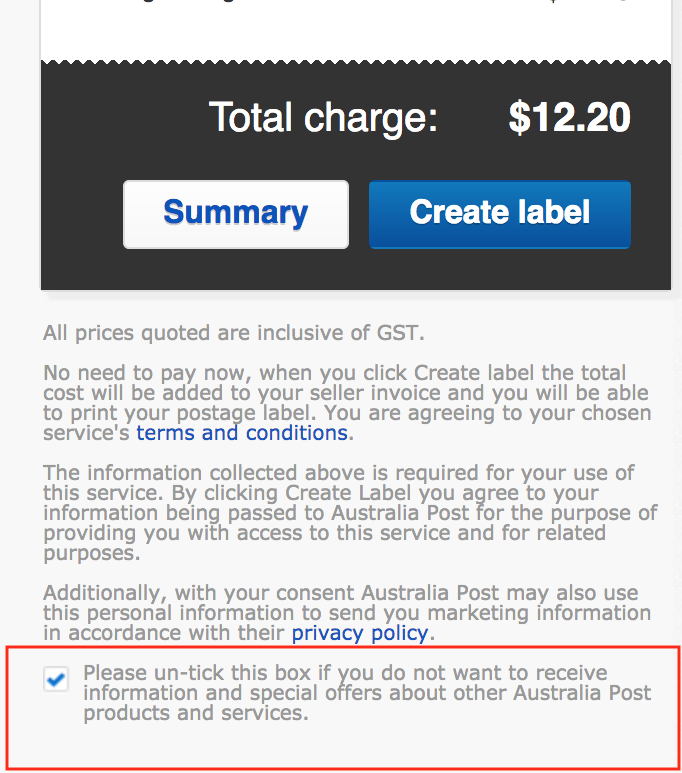

<!-- .slide: data-background="#000" data-transition="fade" -->

---

<!-- .slide: data-background="#000" data-transition="fade" -->

## Dark Patterns <!-- .element: style="color: #aaa" -->

### Into the light <!-- .element: style="color: #aaa" -->

---

<!-- .slide: data-background="#555" data-background-transition="fade" data-transition="fade" -->
## Me

* David Beitey
* @davidjb / @davidjb_
* I wear many hats  🤠 🕵️ 🧙
* UX designer, Developer, Sys Admin...

Notes:

* JCU eResearch Centre; Researchers --> technology
* Lots of different roles in the tech/research space
* Currently a User Experience designer, then I'll put my dev hat on
* Poke me if I get too technical; I'm a dev at heart

---

<!-- .slide: data-background="#aaa" data-background-transition="fade" data-transition="fade" -->

Share, ask questions, discuss
 
(tell me I'm wrong)

---

## ?

Notes:
* Who's heard of Dark Patterns?
* What do you think of when you hear _Dark Patterns_? Eg:
  * Bad design?
  * Poor colour choices?
  * Evil coders and Matrix-code?

<!-- .slide: data-background-iframe="https://code.divshot.com/geo-bootstrap/"
data-background-interactive -->

 <!-- .element class="plain" style="height: 100%; max-height: 50vh"-->
 
Unintentionally confusing

 <!-- .element class="plain" style="height: 100%; max-height: 50vh"-->
 
Or just poor life choices

 <!-- .element class="plain" style="height: 100%; max-height: 30vh"-->

Notes:
* What do you think?
* Shouldn't have been ticked in the first place, no double-neg, etc

 <!-- .element class="plain" style="height: 100%; max-height: 40vh"-->

Notes:
* My head exploded.
* I think I have to leave the box unchecked?
* But _actually_ it's mandatory field! (see the red text)

# 🤯

> Dark Patterns are tricks used in websites and apps that make you buy or sign
> up for things that you didn't mean to. <!-- .element style="font-size: 3rem" -->

 
**Harry Brignull**, darkpatterns.org
 
@darkpatterns

Notes:
* Coined in 2010
* Aims to be a 'pattern library' for naming-and-shaming deceptive UI

Intentionally

1. Confuse
1. Deceive
1. Exploit

Notes:
* Tonight, we're talking design and UI
* But the same things have existed for years
  * Record / CD clubs (dep on your age)
  * Forms with opt-out
  * Non-technical Business practices in general (eg banks who dodge your calls)
* It's called 'Marketing', but now with the power to tailor to your exact eyes

---

## (Anti-)Pattern Library

Notes:
* This was *_really_* hard to prepare for; there's just so much out there.
* If you can think of your own examples or experiences, let's chat as we go -
  put your hand up etc.
* Let's take a look at what I've seen recently 

---

 <!-- .element class="plain logo" -->

Notes:
* Really wanted to rag on these people more, but
* Cleaned up their act a lot
* Why? Human/govt intervention.

---

 <!-- .element class="plain logo" -->

---

 <!-- .element class="plain logo" -->
 
 <!-- .element class="plain logo" -->

---

 <!-- .element class="plain logo" -->
 <!-- .element class="plain logo" -->

---

### David's cheat sheet

If you feel

* pressure,
* panic,
* confusion, or
* see incorrect behaviour...

_It's likely a Dark Pattern._

Notes:
* If something looks to not work _right_ then your spider sense should be
  tingling.  It could just be the system's borked..

